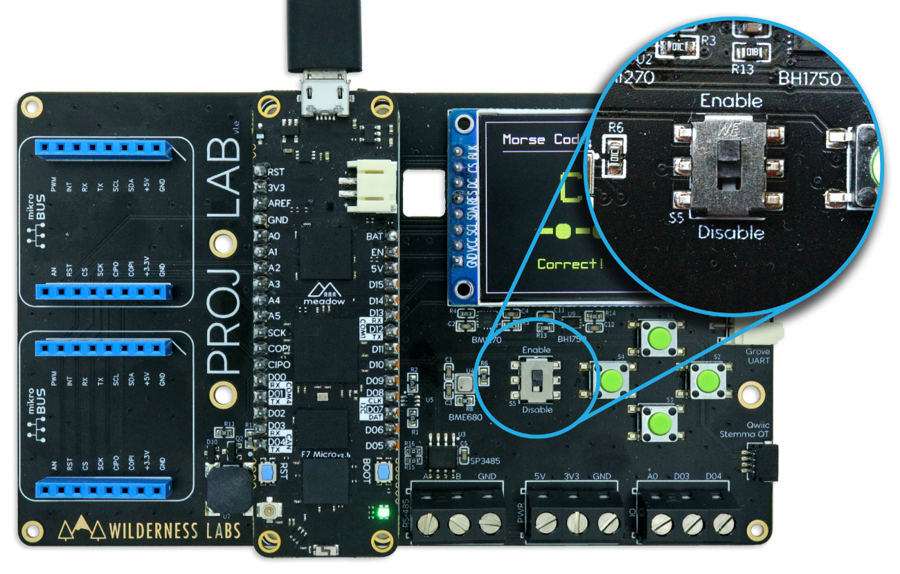

# Meadow.ProjectLab.Samples

This repo contains code samples for the Wilderness Labs Meadow [Project Lab](https://github.com/WildernessLabs/Meadow.Project.Lab) board. Project Lab is a hardware development and prototyping board designed to enable rapid prototyping and IoT software development with [Meadow](http://developer.wildernesslabs.co/Meadow/) and [Meadow.Foundation](http://developer.wildernesslabs.co/Meadow/Meadow.Foundation/).

## Project Samples

<table>
    <tr>
        <td>
             
            Make a Magic Eight ball with a Project Lab 
            <a href="Source/MagicEightMeadow/">Source Code</a>
        </td>
        <td>
             
            Send anvironmental data from a BME688 to Azure IoT Hub 
            <a href="Source/MeadowAzureIoTHub/">Source Code</a>
        </td>
        <td>
             
            Control a Grove Servo with Azure IoT Hub messages 
            <a href="Source/MeadowAzureServo/">Source Code</a>
        </td>
    </tr>
        <td>
             
            Control a Project Lab Board over Wi-Fi with a MAUI app 
            <a href="Source/Connectivity/">Source Code</a>
        </td>
        <td>
             
            Control a Project Lab Board over Bluetooth with a companion app 
            <a href="Source/Connectivity/">Source Code</a>
        </td>
        <td>
             
            Use a Grove Soil Moisture sensor and graph its value on the display 
            <a href="Source/MoistureMeter/">Source Code</a>
        </td>
    </tr>
    <tr>
        <td>
             
            Make an Image Gallery with a ST7789 Display and Meadow. 
            <a href="Source/GalleryViewer/">Source Code</a>
        </td>
        <td>
             
            Weather Station using public web service on a Project Lab Board 
            <a href="Source/WifiWeather/">Source Code</a>
        </td>
        <td>
             
            Draw an analog clock watch face on using MicroGraphics 
            <a href="Source/AnalogClockFace/">Source Code</a>
        </td>
    </tr>
    <tr>
        <td>
             
            Room ambient monitor with a BME688 on a Project Lab Board 
            <a href="Source/AmbientRoomMonitor/">Source Code</a>
        </td>
        <td>
             
            Run a Simon Game on a display and push button d-pad 
            <a href="Source/Simon/">Source Code</a>
        </td>
        <td>
             
            Train your Morse Code spelling skills with Meadow 
            <a href="Source/MorseCodeTrainer/">Source Code</a>
        </td>
    </tr>
    <tr>
        <td>
            
&nbsp;&nbsp;&nbsp;&nbsp;&nbsp;&nbsp;&nbsp;&nbsp;&nbsp;&nbsp;&nbsp;&nbsp;&nbsp;&nbsp;&nbsp;&nbsp;&nbsp;&nbsp;&nbsp;&nbsp;&nbsp;&nbsp;&nbsp;&nbsp;&nbsp;&nbsp;&nbsp;&nbsp;&nbsp;&nbsp;&nbsp;&nbsp;

        </td>
        <td>
            
&nbsp;&nbsp;&nbsp;&nbsp;&nbsp;&nbsp;&nbsp;&nbsp;&nbsp;&nbsp;&nbsp;&nbsp;&nbsp;&nbsp;&nbsp;&nbsp;&nbsp;&nbsp;&nbsp;&nbsp;&nbsp;&nbsp;&nbsp;&nbsp;&nbsp;&nbsp;&nbsp;&nbsp;&nbsp;&nbsp;&nbsp;&nbsp;

        </td>
        <td>
            
&nbsp;&nbsp;&nbsp;&nbsp;&nbsp;&nbsp;&nbsp;&nbsp;&nbsp;&nbsp;&nbsp;&nbsp;&nbsp;&nbsp;&nbsp;&nbsp;&nbsp;&nbsp;&nbsp;&nbsp;&nbsp;&nbsp;&nbsp;&nbsp;&nbsp;&nbsp;&nbsp;&nbsp;&nbsp;&nbsp;&nbsp;&nbsp;

        </td>
    </tr>
</table>

## Onboard On/Off switch

Project Lab boards come with an Enable/Disable switch onboard so you can reset the board by flipping the switch off and on. Make sure the switch is set to ENABLE when intending to work on your project, otherwise it will remain off and it wont be detected on your computer.

    

## Hardware

The Project Lab Board includes the following hardware:
* **ST7789** - SPI 240x240 color display
* **BMI270** - I2C motion and acceleration sensor
* **BH1750** - I2C light sensor
* **BME680** - I2C atmospheric sensor
* **Push Button** - 4 momentary buttons

## Connectivity

The Project Lab Board includes the following expansion connection options:
* **MikroBUS** - 2 sets of MikroBUS pin headers
* **Qwiic** - Stemma QT I2C connector
* **Grove** - analog header
* **Grove** - GPIO/serial header
* **RS-485** - serial 

As well as connectors to 5V, 3.3V, ground, one analog port and 2 GPIO ports.

## Pinout Diagram

Check the diagram below to see what pins on the Meadow are connected to every peripheral on board:
&nbsp;

## License
Copyright 2022, Wilderness Labs Inc.

Licensed under the Apache License, Version 2.0 (the "License");
you may not use this file except in compliance with the License.
You may obtain a copy of the License at

  http://www.apache.org/licenses/LICENSE-2.0

Unless required by applicable law or agreed to in writing, software
distributed under the License is distributed on an "AS IS" BASIS,
WITHOUT WARRANTIES OR CONDITIONS OF ANY KIND, either express or implied.
See the License for the specific language governing permissions and
limitations under the License.
