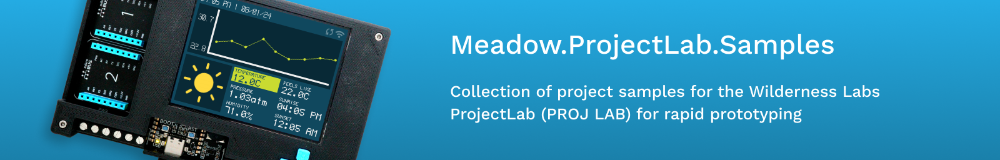
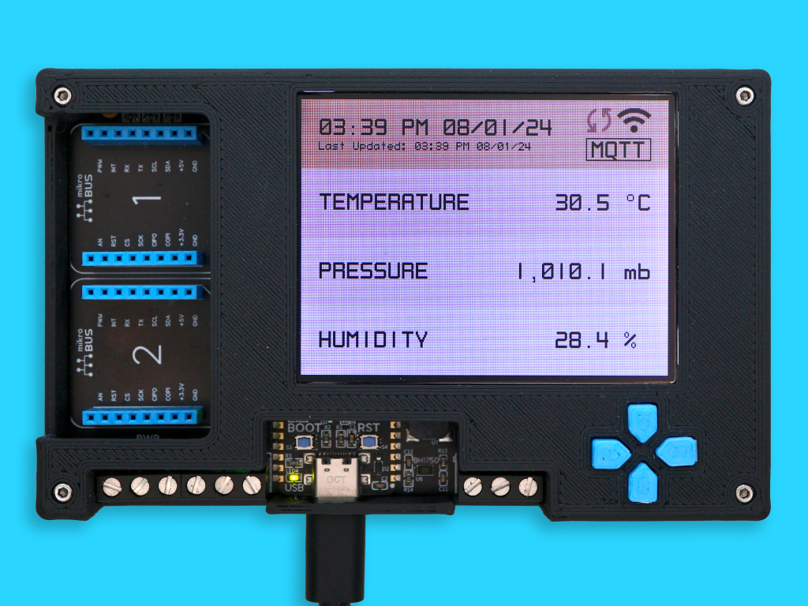
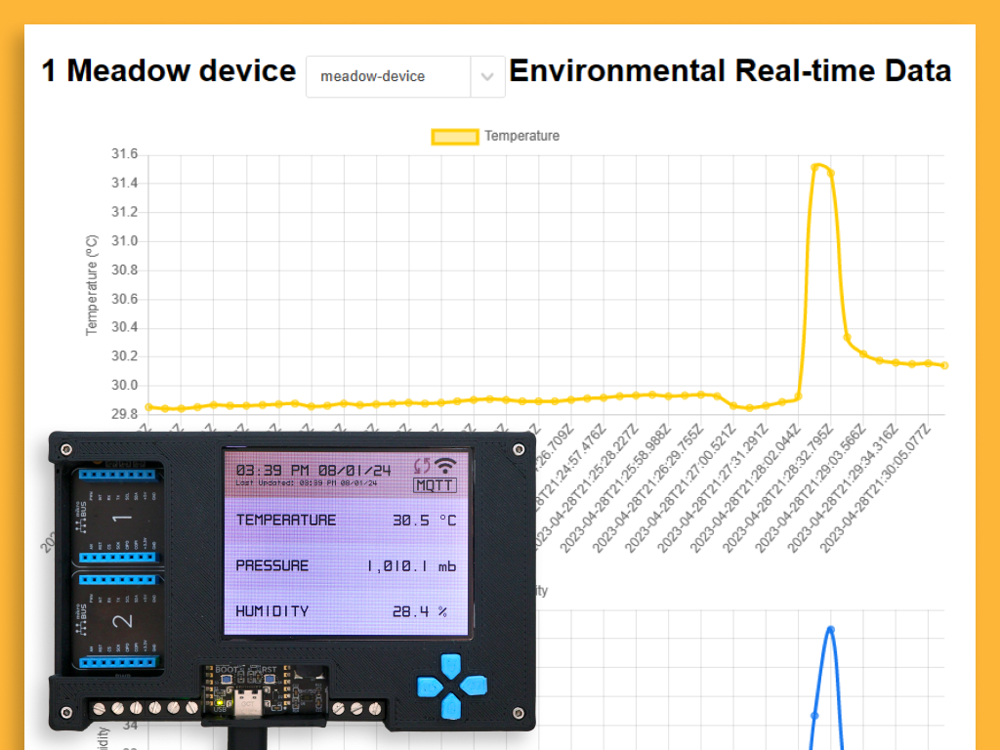
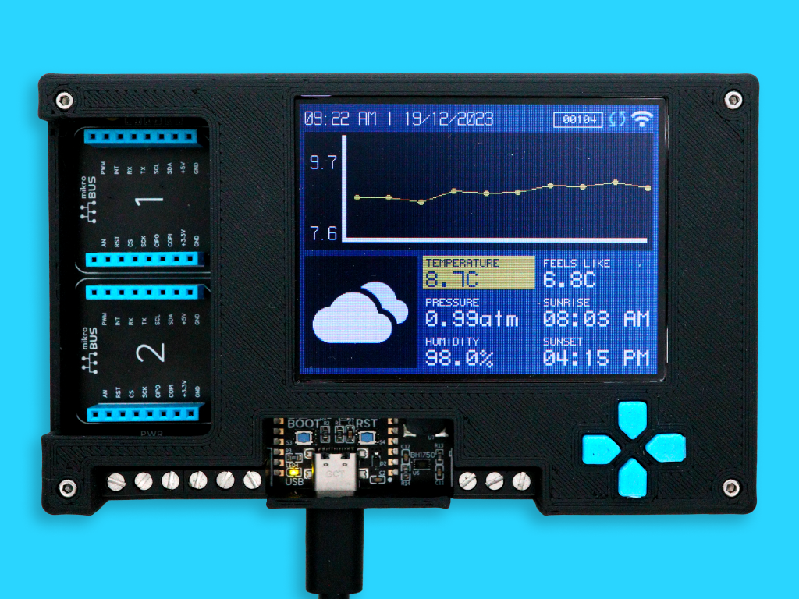

# Meadow.ProjectLab.Samples

This repo contains code samples for the Wilderness Labs Meadow [Project Lab](https://github.com/WildernessLabs/Meadow.Project.Lab) board. Project Lab is a hardware development and prototyping board designed to enable rapid prototyping and IoT software development with [Meadow](http://developer.wildernesslabs.co/Meadow/) and [Meadow.Foundation](http://developer.wildernesslabs.co/Meadow/Meadow.Foundation/).

## Contents
* [Project Samples](#project-samples)
* [Hardware Specifications](#hardware-specifications)
* [Pinout Diagram](#pinout-diagram)
  * [Project Lab v3.e](#project-lab-v3e)
  * [Project Lab v2.e](#project-lab-v2e)
  * [Project Lab v1.e](#project-lab-v1e)
* [License](#license)
* [Support](#support)

## Project Samples

<table>
    <tr>
        <td>
             
            Getting started with Project Lab running a diagnostics app 
            <a href="https://www.hackster.io/wilderness-labs/getting-started-with-meadow-s-project-lab-eeb569">Hackster</a> | 
            <a href="https://github.com/WildernessLabs/Meadow.ProjectLab/tree/main/Source/ProjectLab_Demo">Source Code</a>
        </td>
        <td>
             
            Send anvironmental data from a BME688 to Azure IoT Hub 
            <a href="https://www.hackster.io/wildernesslabs/send-environmental-data-from-projectlab-to-azure-w-iot-hub-7d3d07">Hackster</a> | 
            <a href="Source/MeadowAzureIoTHub/">Source Code</a>
        </td>
        <td>
             
            Visualize environmental data on a Web App from Azure IoT Hub 
            <a href="https://www.hackster.io/wilderness-labs/visualize-azure-iot-hub-data-with-a-net-web-app-6288e3">Hackster</a> | 
            <a href="Source/MagicEightMeadow/">Source Code</a>
        </td>
    </tr>
    <tr>
        <td>
             
            Send environmental data to Meadow.Cloud using Log Event 
            <a href="https://github.com/WildernessLabs/Meadow.Cloud.Samples/tree/main/Source/Meadow.Cloud_Logging">Source Code</a>
        </td>
        <td>
             
            Get log event data from Meadow.Cloud using its client API 
            <a href="https://github.com/WildernessLabs/Meadow.Cloud.Samples/tree/main/Source/Meadow.Cloud_Client">Source Code</a>
        </td>
        <td>
             
            Use Meadow.Cloud commands to control a four channel relay 
            <a href="https://github.com/WildernessLabs/Meadow.Cloud.Samples/tree/main/Source/Meadow.Cloud_Command">Source Code</a>
        </td> 
    </tr>
    <tr>
        <td>
             
            Build HMI screens with MicroLayout for Meadow 
            <a href="https://www.hackster.io/wilderness-labs/build-hmi-screens-with-microlayout-for-your-meadow-apps-b87702">Hackster</a> |
            <a href="Source/MicroLayoutMenu/">Source Code</a>
        </td>
        <td>
             
            Use a Grove Soil Moisture sensor and graph its value on the display 
            <a href="https://www.hackster.io/wilderness-labs/moisturemeter-with-projectlab-and-grove-soil-moisture-sensor-d478fd">Hackster</a> |
            <a href="Source/MoistureMeter/">Source Code</a>
        </td>
        <td>
             
            Make a Magic Eight ball with Project Lab 
            <a href="https://www.hackster.io/wilderness-labs/build-your-own-magic-eight-ball-with-a-projectlab-28044f">Hackster</a> | <a href="Source/MagicEightMeadow/">Source Code</a>
        </td> 
    </tr>
    </tr>
        <td>
             
            Control a Project Lab over Wi-Fi with a MAUI app 
            <a href="Source/Connectivity/">Source Code</a>
        </td>
        <td>
             
            Control a Project Lab over Bluetooth with a MAUI app 
            <a href="Source/Connectivity/">Source Code</a>
        </td>
        <td>
             
            Control a Grove Servo motor with Azure using IoT Hub messages 
            <a href="Source/MeadowAzureServo/">Source Code</a>
        </td>
    </tr>
    <tr>
        <td>
             
            Run an Image Gallery with a Project Lab v3 using MicroGraphics 
            <a href="Source/GalleryViewer/">Source Code</a>
        </td>
        <td>
             
            Weather Station using public web service on a Project Lab v3 
            <a href="Source/WifiWeather/">Source Code</a>
        </td>
        <td>
             
            Draw a working analog clock watch face using MicroGraphics 
            <a href="Source/AnalogClockFace/">Source Code</a>
        </td>
    </tr>
    <tr>
        <td>
             
            Room ambient monitor with a BME688 on a Project Lab 
            <a href="Source/AmbientRoomMonitor/">Source Code</a>
        </td>
        <td>
             
            Run a Simon Game on a display and push button d-pad 
            <a href="Source/Simon/">Source Code</a>
        </td>
        <td>
             
            Train your Morse Code spelling skills with Meadow 
            <a href="Source/MorseCodeTrainer/">Source Code</a>
        </td>
    </tr>
    <tr>
        <td>
            
&nbsp;&nbsp;&nbsp;&nbsp;&nbsp;&nbsp;&nbsp;&nbsp;&nbsp;&nbsp;&nbsp;&nbsp;&nbsp;&nbsp;&nbsp;&nbsp;&nbsp;&nbsp;&nbsp;&nbsp;&nbsp;&nbsp;&nbsp;&nbsp;&nbsp;&nbsp;&nbsp;&nbsp;&nbsp;&nbsp;&nbsp;&nbsp;

        </td>
        <td>
            
&nbsp;&nbsp;&nbsp;&nbsp;&nbsp;&nbsp;&nbsp;&nbsp;&nbsp;&nbsp;&nbsp;&nbsp;&nbsp;&nbsp;&nbsp;&nbsp;&nbsp;&nbsp;&nbsp;&nbsp;&nbsp;&nbsp;&nbsp;&nbsp;&nbsp;&nbsp;&nbsp;&nbsp;&nbsp;&nbsp;&nbsp;&nbsp;

        </td>
        <td>
            
&nbsp;&nbsp;&nbsp;&nbsp;&nbsp;&nbsp;&nbsp;&nbsp;&nbsp;&nbsp;&nbsp;&nbsp;&nbsp;&nbsp;&nbsp;&nbsp;&nbsp;&nbsp;&nbsp;&nbsp;&nbsp;&nbsp;&nbsp;&nbsp;&nbsp;&nbsp;&nbsp;&nbsp;&nbsp;&nbsp;&nbsp;&nbsp;

        </td>
    </tr>
</table>

## Hardware Specifications

<table>
    <tr>
        <th>Onboard Peripherals</th>
        <th>Connectivity</th>
    </tr>
    <tr>
        <td><strong>ILI9341</strong> - SPI 320x240 color display</li></td>
        <td><strong>MikroBUS</strong> - Two sets of MikroBUS pin headers</td>
    </tr>
    <tr>
        <td><strong>BMI270</strong> - I2C motion and acceleration sensor</td>
        <td><strong>Qwiic</strong> - Stemma QT I2C connector</td>
    </tr>
    <tr>
        <td><strong>BH1750</strong> - I2C light sensor</td>
        <td><strong>Grove</strong> - Analog header</td>
    </tr>
    <tr>
        <td><strong>BME688</strong> - I2C atmospheric sensor</td>
        <td><strong>Grove</strong> - GPIO/serial header</td>
    </tr>
    <tr>
        <td><strong>Push Button</strong> - 4 momentary buttons</td>
        <td><strong>RS-485</strong> - Serial</td>
    </tr>
    <tr>
        <td><strong>Magnetic Audio Transducer</strong> - High quality piezo speaker</td>
        <td><strong>Ports</strong> - 3.3V, 5V, ground, one analog and two GPIO ports</td>
    </tr>
</table>

## Pinout Diagram

Check the diagrams below to see what pins on the Meadow are connected to every peripheral on board and its connectors:
&nbsp;

### Project Lab v3.e

### Project Lab v2.e

### Project Lab v1.e

## License
Copyright 2023, Wilderness Labs Inc.

Licensed under the Apache License, Version 2.0 (the "License");
you may not use this file except in compliance with the License.
You may obtain a copy of the License at

  http://www.apache.org/licenses/LICENSE-2.0

Unless required by applicable law or agreed to in writing, software
distributed under the License is distributed on an "AS IS" BASIS,
WITHOUT WARRANTIES OR CONDITIONS OF ANY KIND, either express or implied.
See the License for the specific language governing permissions and
limitations under the License.

## Support

Having trouble building/running these projects? 
* File an [issue](https://github.com/WildernessLabs/Meadow.Desktop.Samples/issues) with a repro case to investigate, and/or
* Join our [public Slack](http://slackinvite.wildernesslabs.co/), where we have an awesome community helping, sharing and building amazing things using Meadow.
